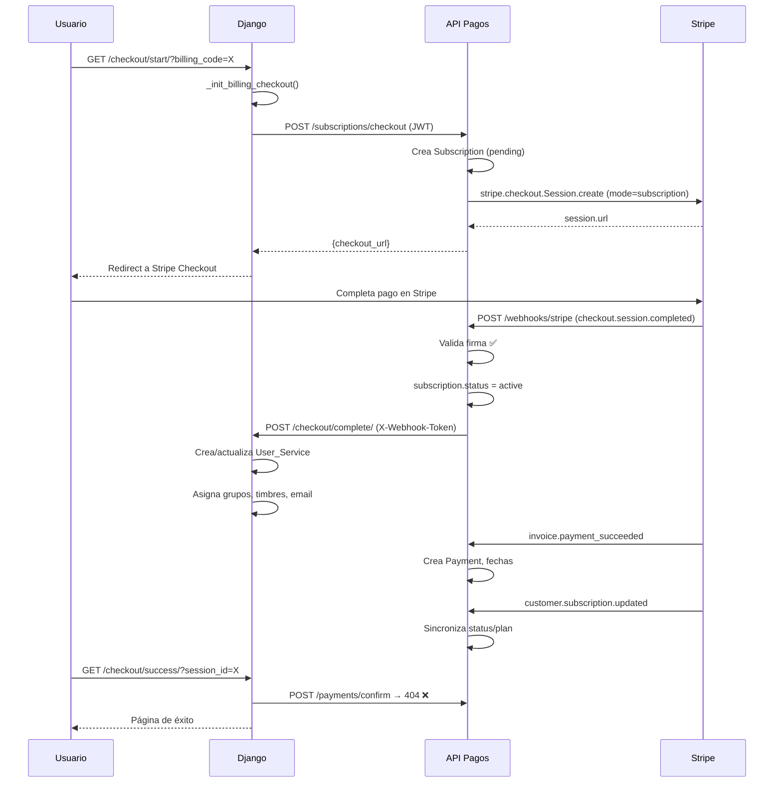
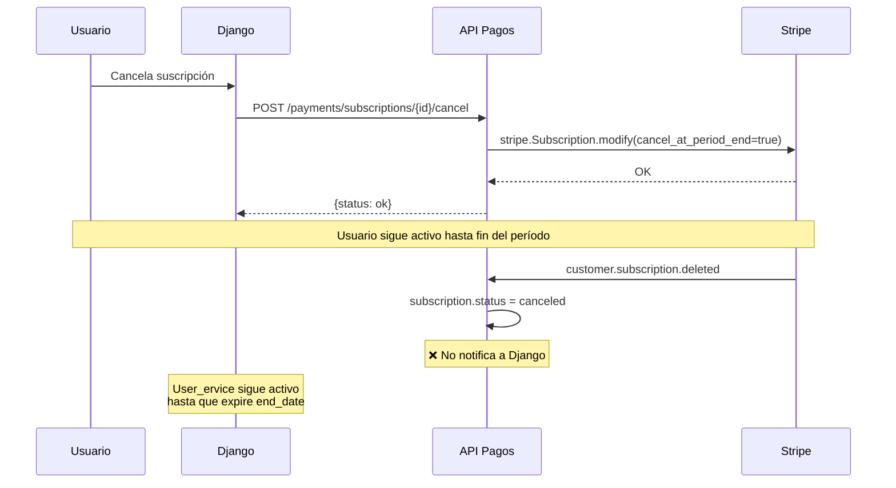
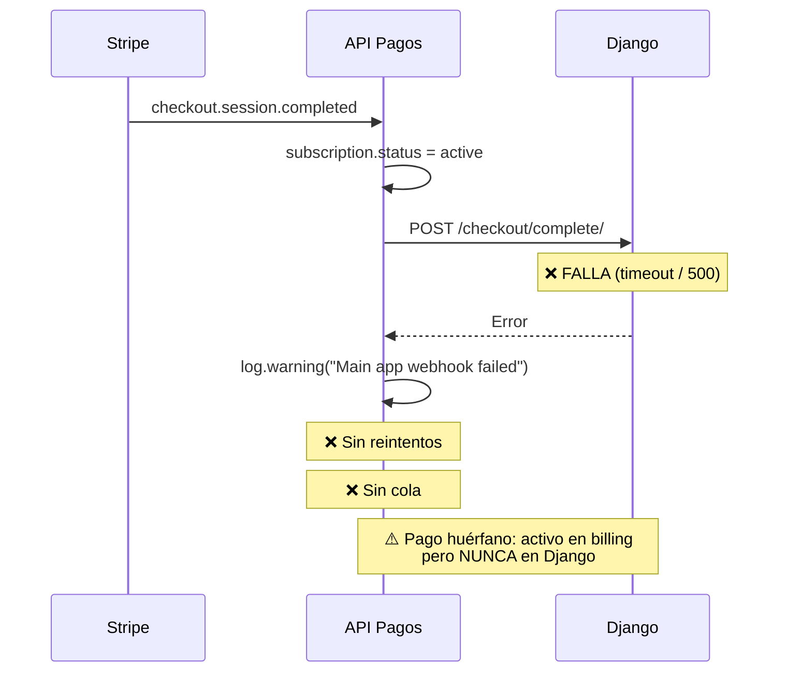
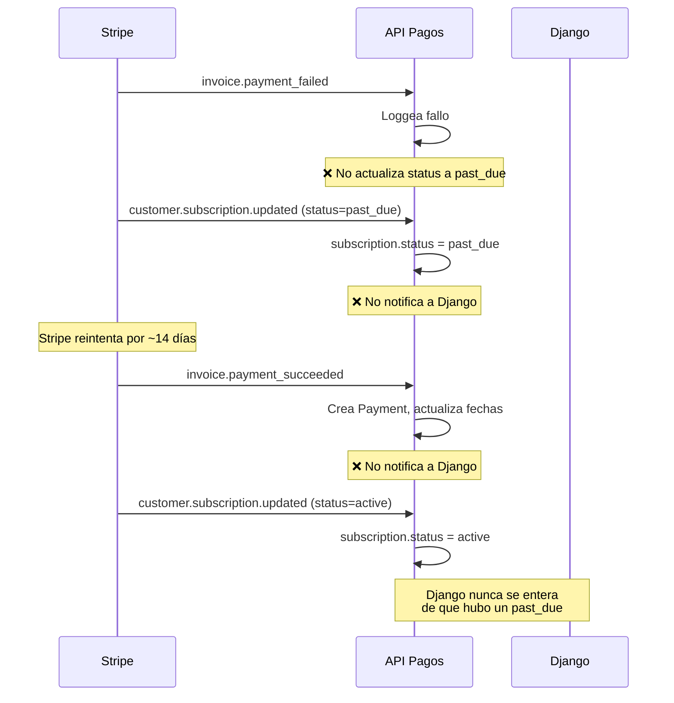
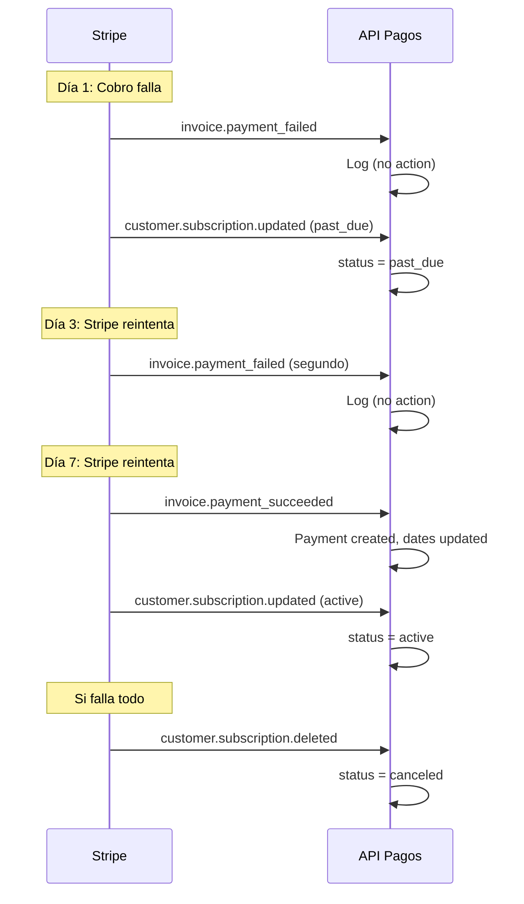

# Auditoría de Seguridad y Flujos — API de Pagos Factupid

> **Fecha:** 2026-06-16
> **Repositorio:** `factupid-billing-service/api_cobranza`
> **Objetivo:** Verificar integridad de flujos de pago, webhooks, comunicación con Django y seguridad de endpoints.

---

## Tabla de Contenidos

1. [Stack Tecnológico](#1-stack-tecnológico)
2. [Mapa de Endpoints](#2-mapa-de-endpoints)
3. [Modelos de Datos](#3-modelos-de-datos)
4. [Variables de Entorno](#4-variables-de-entorno)
5. [Verificaciones Específicas](#5-verificaciones-específicas)
6. [Análisis de Brechas de Seguridad](#6-análisis-de-brechas-de-seguridad)
7. [Flujos Reconstruidos](#7-flujos-reconstruidos)
8. [Diagramas Mermaid](#8-diagramas-mermaid)
9. [Tabla de Estados](#9-tabla-de-estados)
10. [Hallazgos Críticos](#10-hallazgos-críticos)
11. [Propuesta de Corrección por Fases](#11-propuesta-de-corrección-por-fases)

---

## 1. Stack Tecnológico

| Componente | Tecnología | Versión |
|---|---|---|
| Framework | FastAPI | 0.115.3 |
| ORM | SQLModel (SQLAlchemy 2.0) | 0.0.22 |
| Autenticación | JWT RS256 (python-jose) | — |
| Pagos | Stripe | 14.1.0 |
| Cliente HTTP | httpx | — |
| Base de datos | PostgreSQL / SQLite (dev) | — |
| Migraciones | Alembic | 1.18.4 |

---

## 2. Mapa de Endpoints

### 2.1 Endpoints Públicos (Sin autenticación)

| Archivo | Endpoint | Método | Payload | Respuesta | Actualiza | Procesa evento Stripe |
|---|---|---|---|---|---|---|
| `routers/payments.py:19` | `/payments/init` | POST | `{user_id, plan_code}` | `{subscription, checkout_url}` | `subscription` (crea pending), `stripe_checkout_session` (mode=payment) | ❌ No (solo crea sesión) |
| `routers/payments.py:81` | `/payments/subscriptions/{id}/cancel` | POST | `{at_period_end}` | `{status, subscription_id}` | `subscription` (cancel_at_period_end, status) | ❌ No (llama Stripe API directamente) |
| `routers/subscriptions.py:170` | `/subscriptions/change-plan` | POST | `{user_id, new_plan_code}` | `{message, type}` | `subscription.plan_id`, `stripe_schedule_id` | ❌ No (maneja upgrade/downgrade directo) |
| `routers/subscriptions.py:337` | `/subscriptions/preview-plan-change` | POST | `{user_id, new_plan_code}` | `{change_type, amount_due, ...}` | Ninguna (solo consulta) | ❌ No (solo preview) |
| `routers/subscriptions.py:443` | `/subscriptions/test-access/{user_id}` | GET | — | `{user_id, status, puede_acceder}` | Ninguna (solo consulta) | ❌ No |
| `routers/plans.py:18` | `/plans/` | GET | — | `[{id, name, price, ...}]` | Ninguna (solo consulta) | ❌ No |
| `routers/plans.py:38` | `/plans/create-stripe` | POST | `{code, name, price, ...}` | `{Plan}` | `plan` (crea en BD y Stripe) | ❌ No |
| `routers/plans.py:78` | `/plans/register` | POST | `{code, name, stripe_price_id, ...}` | `{Plan}` | `plan` (registra Stripe IDs) | ❌ No |
| `routers/plans.py:113` | `/plans/{plan_code}` | PATCH | `{field: value}` | `{Plan}` | `plan` (actualiza local) | ❌ No |

### 2.2 Endpoints con JWT

| Archivo | Endpoint | Método | Permiso Requerido | Payload | Respuesta | Actualiza |
|---|---|---|---|---|---|---|
| `routers/subscriptions.py:22` | `/subscriptions/checkout` | POST | `billing.create_checkout` | `?user_id=X&plan_code=Y` (query params) | `{checkout_url, subscription_id}` | `subscription` (crea pending o reusa) |
| `routers/test_auth.py:9` | `/auth-test/me` | GET | Solo JWT válido | — | Claims del token | Ninguna |
| `routers/test_auth.py:26` | `/auth-test/can-view-payments` | GET | `billing.view_payments` | — | Confirmación | Ninguna |
| `routers/test_auth.py:40` | `/auth-test/can-CREATE_CHECKOUT` | GET | `billing.create_checkout` | — | Confirmación | Ninguna |

### 2.3 Endpoint Webhook (Validación Stripe)

| Archivo | Endpoint | Método | Autenticación | Payload | Respuesta | Actualiza |
|---|---|---|---|---|---|---|
| `routers/webhooks.py:16` | `/webhooks/stripe` | POST | Firma Stripe (`stripe-signature`) | Raw body + `stripe-signature` header | `{status: "ok"}` | `subscription`, `payment` |

**Eventos Stripe manejados:**

| Evento | Handler | Línea | Qué hace |
|---|---|---|---|
| `checkout.session.completed` | `handle_checkout_completed` | 111 | Activa `subscription.status = "active"`, asigna `stripe_subscription_id`, notifica a Django |
| `payment_intent.succeeded` | `handle_one_time_payment` | 169 | Crea `Payment` para pagos únicos |
| `invoice.payment_succeeded` | `handle_subscription_payment` | 199 | Crea `Payment`, actualiza `start_date`/`end_date` desde Stripe, maneja cancel_at_period_end |
| `customer.subscription.deleted` | `handle_subscription_deleted` | 437 | Marca `subscription.status = "canceled"` |
| `invoice.payment_failed` | `handle_invoice_payment_failed` | 500 | Log del fallo (NO actualiza status a `past_due`) |
| `customer.subscription.updated` | `handle_subscription_updated` | 549 | Sincroniza plan_id, status, cancel_at_period_end, canceled_at |

### 2.4 Endpoint FALTANTE: `/payments/confirm`

**Django hace POST a `{COBRANZA_API_BASE}/payments/confirm`** desde `checkout_success()` (línea 1261 de `console/views.py`), pero **este endpoint NO EXISTE en la API de pagos**.

```python
# Django llama a:
POST {COBRANZA_API_BASE}/payments/confirm  # → 404 Not Found
```

---

## 3. Modelos de Datos

### 3.1 `Plan` (`models/plan.py`)

| Campo | Tipo | Notas |
|---|---|---|
| `id` | int PK | — |
| `code` | str (unique) | `CFDI_FREE`, `CFDI_PRO`, etc. |
| `name` | str | Nombre visible |
| `price` | int | En pesos MXN |
| `currency` | str(3) | `MXN` |
| `interval` | str? | `month`, `year` o `null` (one_time) |
| `billing_type` | str | `one_time` o `subscription` |
| `stripe_product_id` | str? | Solo para suscripciones |
| `stripe_price_id` | str? | Solo para suscripciones |
| `is_active` | bool | default True |
| `created_at` | datetime | auto |

### 3.2 `Subscription` (`models/subscription.py`)

| Campo | Tipo | Notas |
|---|---|---|
| `id` | int PK | — |
| `user_id` | int | FK lógica al usuario en Django |
| `plan_id` | int | FK → `plan.id` |
| `status` | str | `pending`, `active`, `expired`, `canceled` (descrito); también almacena `past_due`, `incomplete` |
| `provider` | str | `stripe` |
| `stripe_subscription_id` | str? | ID en Stripe |
| `stripe_schedule_id` | str? | Para downgrades programados |
| `start_date` | date? | Del período Stripe |
| `end_date` | date? | Del período Stripe |
| `created_at` | datetime | auto |
| `canceled_at` | datetime? | Fecha de cancelación |
| `cancel_at_period_end` | bool | default False |

**Campos NO almacenados:**
- ❌ `email` del usuario
- ❌ `billing_code`
- ❌ `service_id`
- ❌ `checkout_session_id` (se pierde después del webhook)

### 3.3 `Payment` (`models/payment.py`)

| Campo | Tipo | Notas |
|---|---|---|
| `id` | int PK | — |
| `subscription_id` | int | FK → `subscription.id` |
| `provider` | str | `stripe` |
| `provider_payment_id` | str (unique) | Invoice ID o PaymentIntent ID |
| `amount` | int | En centavos |
| `currency` | str | `mxn` |
| `status` | str | `succeeded`, `failed`, `pending` |
| `paid_at` | datetime | auto |
| `raw_event` | dict? | JSON con payload completo del evento Stripe |

---

## 4. Variables de Entorno

| Variable | Archivo `.env` | Se usa en | Propósito |
|---|---|---|---|
| `STRIPE_SECRET_KEY` | ✅ | `stripe_service.py`, `webhooks.py` | API key de Stripe |
| `STRIPE_PUBLISHABLE_KEY` | ✅ | `config.py` (solo lectura) | Publishable key |
| `STRIPE_ENDPOINT_SECRET` | ✅ | `webhooks.py:30` | Firma de webhook Stripe |
| `STRIPE_SUCCESS_URL` | ✅ | `stripe_service.py` | Redirección post-pago exitoso |
| `STRIPE_CANCEL_URL` | ✅ | `stripe_service.py` | Redirección post-cancelación |
| `COBRANZA_WEBHOOK_SECRET` | ⚠️ **TRUNCADO** | `webhooks.py:77` | Secreto compartido con Django |
| `MAIN_APP_BASE` | ✅ | `webhooks.py:70` | URL base de Django |
| `DATABASE_URL` | ✅ | `db/session.py` | Conexión PostgreSQL |
| `JWT_PUBLIC_KEY` | ✅ | `core/security.py` | Clave RSA pública |
| `JWT_ALGORITHM` | ✅ | `core/security.py` | Algoritmo JWT (`RS256`) |
| `JWT_ISSUER` | ✅ | `core/security.py` | Issuer (`https://app.factupid.com`) |
| `JWT_AUDIENCE` | ✅ | `core/security.py` | Audience (`billing-api`) |
| `JWT_ACCESS_TOKEN_EXPIRE_MINUTES` | ✅ | `config.py` | 15 minutos |

**⚠️ Problema:** `COBRANZA_WEBHOOK_SECRET` en `.env` aparece **truncado** (termina en `>`) — valor real: `"63af5dde9a404a791b6179a826d42ee9659769cac649368e9705bc>"`

---

## 5. Verificaciones Específicas

### 5.1 ✅ Validación de Stripe-Signature

**Sí se valida** en `webhooks.py:27-31`:

```python
event = stripe.Webhook.construct_event(
    payload=payload,
    sig_header=sig_header,
    secret=settings.STRIPE_ENDPOINT_SECRET,
)
```

Si la firma no es válida, retorna `400 Invalid signature`.

### 5.2 ⚠️ JWT en endpoints internos

| Endpoint | ¿Requiere JWT? | ¿Requiere permiso? |
|---|---|---|
| `POST /subscriptions/checkout` | ✅ Sí | ✅ `billing.create_checkout` |
| `POST /payments/init` | ❌ **No** | ❌ **No** |
| `POST /payments/subscriptions/{id}/cancel` | ❌ **No** | ❌ **No** |
| `POST /subscriptions/change-plan` | ❌ **No** | ❌ **No** |
| `POST /subscriptions/preview-plan-change` | ❌ **No** | ❌ **No** |
| `GET /subscriptions/test-access/{user_id}` | ❌ **No** | ❌ **No** |
| `POST /plans/create-stripe` | ❌ **No** | ❌ **No** |
| `POST /plans/register` | ❌ **No** | ❌ **No** |
| `PATCH /plans/{plan_code}` | ❌ **No** | ❌ **No** |

### 5.3 ❌ `/payments/confirm` no existe

El endpoint `/payments/confirm` al que Django hace POST no está definido en ningún router. Causará 404.

### 5.4 ✅ Llamada a Django `/checkout/complete/`

**Sí existe** en `webhooks.py:59-106` (`notify_main_app()`). Se llama desde:

- `handle_checkout_completed()` (línea 159)

**No se llama desde:**
- `handle_subscription_payment()` (renovaciones)
- `handle_one_time_payment()`
- `handle_subscription_deleted()`
- `handle_invoice_payment_failed()`
- `handle_subscription_updated()`

### 5.5 ✅ Se envía `X-Webhook-Token`

En `webhooks.py:77-78`:

```python
if settings.COBRANZA_WEBHOOK_SECRET:
    headers["X-Webhook-Token"] = settings.COBRANZA_WEBHOOK_SECRET
```

**⚠️ El token se envía condicionalmente** — si `COBRANZA_WEBHOOK_SECRET` es `None` (no configurado), no se envía.

### 5.6 ❌ Sin reintentos hacia Django

`notify_main_app()` usa `httpx.Client(timeout=10)` sin reintentos:

```python
try:
    with httpx.Client(timeout=10) as client:
        response = client.post(url, json=payload, headers=headers)
        if response.status_code >= 400:
            logger.warning(...)
except Exception as exc:
    logger.warning("Main app webhook error: %s", exc)
```

- Timeout: 10 segundos
- Reintentos: **0**
- Si Django no responde → el pago queda **huérfano** (activo en billing API, pero `User_Service` nunca se crea en Django)

### 5.7 ⚠️ Relaciones guardadas en BD

| Relación | ¿Se guarda? | Dónde |
|---|---|---|
| `user_id` ↔ `Subscription` | ✅ | `subscription.user_id` |
| `plan_id` ↔ `Subscription` | ✅ | `subscription.plan_id` |
| `stripe_customer_id` ↔ `Subscription` | ❌ **No se guarda** | Stripe lo asigna automáticamente, no se persiste |
| `stripe_subscription_id` ↔ `Subscription` | ✅ | `subscription.stripe_subscription_id` |
| `checkout_session_id` ↔ `Subscription` | ❌ **No se guarda** | Solo se usa en metadata del webhook |
| `email` ↔ `Subscription` | ❌ **No se guarda** | — |
| `billing_code` ↔ `Subscription` | ❌ **No se guarda** | Solo viaja en metadata de Stripe |
| `service_id` ↔ `Subscription` | ❌ **No se guarda** | Solo viaja en `notify_main_app()` |

### 5.8 ⚠️ `success_url` es solo informativa

La `success_url` apunta a `http://127.0.0.1:8001/checkout/success/?session_id={CHECKOUT_SESSION_ID}` (Django).

Django en `checkout_success()`:
1. Hace POST a `/payments/confirm` (que no existe)
2. Renderiza pantalla de éxito

**La activación real ocurre vía webhook**, no via `success_url`.

### 5.9 ⚠️ Riesgo de activación por eventos falsos

**Medio.** Consideraciones:

1. ✅ Stripe valida la firma → no se puede falsificar un evento
2. ⚠️ `handle_checkout_completed` no verifica `payment_status === "paid"` antes de activar
3. ⚠️ `customer.subscription.updated` con status `active` también actualiza `subscription.status` directamente (línea 626), incluso si Stripe no lo ha confirmado como pago
4. ⚠️ `checkout.session.completed` se dispara incluso si el pago queda en `unpaid` (para `mode="payment"`) o si la suscripción queda en `incomplete` (para `mode="subscription"` con autenticación diferida)

---

## 6. Análisis de Brechas de Seguridad

### 6.1 Endpoints sin autenticación (Criticidad: 🔴 Alta)

**6 endpoints internos** no requieren JWT:
- `/payments/init` — crea suscripciones y sesiones Stripe
- `/payments/subscriptions/{id}/cancel` — cancela suscripciones
- `/subscriptions/change-plan` — cambia planes
- `/subscriptions/preview-plan-change` — vista previa de cambios
- `/subscriptions/test-access/{user_id}` — prueba de acceso
- `/plans/*` — CRUD de planes

Cualquier persona con la URL puede:
- Crear suscripciones y sesiones de pago
- Cancelar suscripciones de otros usuarios
- Cambiar planes sin autorización
- Listar y modificar planes

### 6.2 Sin idempotencia en webhooks (Criticidad: 🟡 Media)

- `checkout.session.completed` podría procesarse múltiples veces → múltiples `notify_main_app()` → múltiples `User_Service` en Django
- No hay chequeo de `checkout_session_id` antes de activar
- El único control de idempotencia está en `handle_subscription_payment` (línea 280-288) verificando `provider_payment_id`

### 6.3 Sin reintentos ni cola (Criticidad: 🔴 Alta)

- Si Django no responde al webhook, el pago se activa en billing API pero NUNCA llega a Django
- No hay cola de mensajes (RabbitMQ, Redis, SQS)
- No hay job de reconciliación periódica
- El error solo se loggea y se pierde

### 6.4 `COBRANZA_WEBHOOK_SECRET` truncado (Criticidad: 🟡 Media)

El valor en `.env` termina con `>` — posible truncamiento. Si está mal, la comunicación con Django fallará silenciosamente (Django no validaría el token, rechazaría la petición).

### 6.5 Status `past_due` no manejado (Criticidad: 🟡 Media)

- `handle_invoice_payment_failed` loggea el fallo pero **no actualiza el status**
- `handle_subscription_updated` sí sincroniza `subscription.status = stripe_status`, por lo que `past_due` llegaría a través de ese evento
- No hay lógica de corte de servicio por `past_due` — `puede_acceder()` retorna `True` para `past_due`, lo cual es correcto mientras Stripe reintenta

### 6.6 `handle_checkout_completed` sin verificar `payment_status` (Criticidad: 🟡 Media)

```python
# No se verifica session_data.get("payment_status") == "paid"
# No se verifica session_data.get("status") == "complete"
subscription.status = "active"  # Se activa sin importar el estado real del pago
```

---

## 7. Flujos Reconstruidos

### 7.1 Flujo: Django inicia checkout

```
Usuario                     Django                          API Pagos (FastAPI)              Stripe
   │                           │                                    │                          │
   │  GET /checkout/start/     │                                    │                          │
   │─────────────────────────>│                                    │                          │
   │                           │                                    │                          │
   │                           │  _init_billing_checkout()          │                          │
   │                           │  Genera JWT (15 min)              │                          │
   │                           │                                    │                          │
   │                           │  POST /subscriptions/checkout      │                          │
   │                           │  ?user_id=X&plan_code=Y            │                          │
   │                           │  Authorization: Bearer <JWT>       │                          │
   │                           │───────────────────────────────────>│                          │
   │                           │                                    │                          │
   │                           │                                    │  Plan existe? Activo?    │
   │                           │                                    │  Ya tiene active? (409)  │
   │                           │                                    │  Reusa pending/incomplete│
   │                           │                                    │  /past_due?              │
   │                           │                                    │  Crea Subscription       │
   │                           │                                    │  Crea Stripe Checkout    │
   │                           │                                    │  (mode="subscription")   │
   │                           │                                    │                          │
   │                           │                                    │  stripe.checkout.Session │
   │                           │                                    │─────────────────────────>│
   │                           │                                    │                          │
   │                           │          {checkout_url}            │                          │
   │                           │<───────────────────────────────────│                          │
   │                           │                                    │                          │
   │  Redirect checkout_url    │                                    │                          │
   │<──────────────────────────│                                    │                          │
   │                           │                                    │                          │
   │───────────────────────────────────────────────────────────────────────────────────────>│
```

### 7.2 Flujo: Pago exitoso (webhook)

```
Stripe                          API Pagos (FastAPI)               Django
   │                                    │                            │
   │ checkout.session.completed         │                            │
   │──────────────────────────────────>│                            │
   │                                    │                            │
   │  Valida Stripe-Signature ✅        │                            │
   │  handle_checkout_completed()       │                            │
   │                                    │                            │
   │  1. subscription.status = "active" │                            │
   │  2. stripe_subscription_id = ✓     │                            │
   │  3. Del metadata: billing_code     │                            │
   │                                    │                            │
   │  4. notify_main_app()              │                            │
   │     POST /checkout/complete/       │                            │
   │     X-Webhook-Token: <secret>      │                            │
   │     {user_id, billing_code,        │                            │
   │      subscription_id, plan_id,     │                            │
   │      service_id, date_cutoff}      │                            │
   │──────────────────────────────────────────────────────────────>│
   │                                    │                            │
   │                                    │                            │ Valida X-Webhook-Token
   │                                    │                            │ Crea/actualiza User_Service
   │                                    │                            │ Asigna grupos
   │                                    │                            │ Configura timbres
   │                                    │                            │ Envía email
   │                                    │                            │
   │                                    │                            │
   │ invoice.payment_succeeded          │                            │
   │──────────────────────────────────>│                            │
   │                                    │                            │
   │  handle_subscription_payment()     │                            │
   │  1. Crea Payment                   │                            │
   │  2. Actualiza start/end_date       │                            │
   │  3. Si cancel_at_period_end →      │                            │
   │     status = "canceled"            │                            │
   │                                    │                            │
   │ customer.subscription.updated      │                            │
   │──────────────────────────────────>│                            │
   │                                    │                            │
   │  handle_subscription_updated()     │                            │
   │  1. status = stripe_status         │                            │
   │  2. plan_id sincronizado           │                            │
```

### 7.3 Flujo: Pago cancelado

```
Usuario                     Django                          API Pagos                       Stripe
   │                           │                                │                              │
   │  Clic "Cancelar"          │                                │                              │
   │─────────────────────────>│                                │                              │
   │                           │                                │                              │
   │                           │  POST /payments/subscriptions/  │                              │
   │                           │  {id}/cancel                   │                              │
   │                           │  {"at_period_end": true}       │                              │
   │                           │───────────────────────────────>│                              │
   │                           │                                │                              │
   │                           │                                │  stripe.Subscription.modify(  │
   │                           │                                │    cancel_at_period_end=True) │
   │                           │                                │─────────────────────────────>│
   │                           │                                │                              │
   │                           │  {status: "ok"}                │                              │
   │                           │<───────────────────────────────│                              │
   │                           │                                │                              │
   │  (Usuario sigue activo    │                                │                              │
   │   hasta fin del período)  │                                │                              │
   │                           │                                │                              │
   │  ... fin del período ...  │                                │                              │
   │                           │                                │                              │
   │                           │                                │  customer.subscription.deleted│
   │                           │                                │<─────────────────────────────│
   │                           │                                │                              │
   │                           │                                │  status = "canceled"         │
   │                           │                                │  ❌ NO notify_main_app()     │
```

### 7.4 Flujo: Pago fallido (past_due)

```
Stripe                          API Pagos                       Django
   │                                │                              │
   │ invoice.payment_failed          │                              │
   │ (billing_reason=subscription_cycle)                           │
   │───────────────────────────────>│                              │
   │                                │                              │
   │  handle_invoice_payment_failed()                               │
   │  - Loggea el fallo             │                              │
   │  - NO actualiza status         │                              │
   │  - NO notifica a Django        │                              │
   │                                │                              │
   │ customer.subscription.updated  │                              │
   │ (status=past_due)              │                              │
   │───────────────────────────────>│                              │
   │                                │                              │
   │  handle_subscription_updated() │                              │
   │  - subscription.status = "past_due"                           │
   │  - ❌ NO notify_main_app()     │                              │
   │                                │                              │
   │ Stripe reintenta cobro (4-14 días)                            │
   │ Invoice intentos automáticos   │                              │
   │                                │                              │
   │ invoice.payment_succeeded      │                              │
   │───────────────────────────────>│                              │
   │                                │                              │
   │  handle_subscription_payment() │                              │
   │  - Crea Payment                │                              │
   │  - Actualiza fechas            │                              │
   │  - status sigue "active"       │                              │
   │  - ❌ NO notify_main_app()     │                              │
   │                                │                              │
   │ customer.subscription.updated  │                              │
   │ (status=active)                │                              │
   │───────────────────────────────>│                              │
   │  handle_subscription_updated() │                              │
   │  - subscription.status = "active"                             │
```

### 7.5 Flujo: Webhook fallido (Django no responde)

```
Stripe                          API Pagos                       Django
   │                                │                              │
   │ checkout.session.completed     │                              │
   │───────────────────────────────>│                              │
   │                                │                              │
   │  subscription.status = "active"│                              │
   │                                │                              │
   │  notify_main_app()             │                              │
   │  POST /checkout/complete/      │                              │
   │─────────────────────────────────────────────────────────────>│
   │                                │                              │  (FALLA: timeout/500)
   │                                │                              │
   │  ⚠️ loggea warning             │                              │
   │  ❌ No reintenta               │                              │
   │  ❌ No encola                  │                              │
   │                                │                              │
   │  ⚠️ Subscription queda "active"│                              │
   │     en billing API             │                              │
   │  ⚠️ User_Service NUNCA creado │                              │
   │     en Django                  │                              │
```

---

## 8. Diagramas Mermaid

### 8.1 Flujo de pago exitoso



### 8.2 Flujo de pago cancelado



### 8.3 Flujo de webhook fallido



### 8.4 Flujo de past_due



### 8.5 Flujo de reintento de pago



---

## 9. Tabla de Estados

### 9.1 Mapeo Estados Stripe ↔ API Pagos

| Estado Stripe | ¿Se almacena? | ¿Dónde se asigna? | Comportamiento |
|---|---|---|---|
| `active` | ✅ | `handle_checkout_completed`, `handle_subscription_updated` | Acceso completo |
| `past_due` | ✅ | `handle_subscription_updated` (directo de Stripe) | Acceso permitido (Stripe reintenta) |
| `canceled` | ✅ | `handle_subscription_deleted`, `handle_subscription_payment` (si cancel_at_period_end), `handle_subscription_updated` | Acceso bloqueado (excepto si cancel_at_period_end y end_date >= today) |
| `incomplete` | ✅ | Revisado en `start_subscription` para reuso | No listado en `puede_acceder` → bloqueado |
| `incomplete_expired` | ❌ **Nunca se referencia** | — | No listado → bloqueado |
| `trialing` | ✅ | Podría venir de `customer.subscription.updated` | Acceso completo |
| `unpaid` | ❌ **Nunca se referencia** | — | Bloqueado |
| `paused` | ❌ **Nunca se referencia** | — | Bloqueado |

### 9.2 Tabla de Estados por Flujo

| Flujo | Endpoint inicial | Endpoint final | Estado inicial (BD) | Estado final esperado | Estado final actual (código) | Riesgo | Recomendación |
|---|---|---|---|---|---|---|---|
| **Checkout exitoso (suscripción)** | `POST /subscriptions/checkout` | Webhook `checkout.session.completed` | `pending` | `active` | `active` ✅ | 🟡 No verifica `payment_status` en sesión | Verificar `payment_status == "paid"` y `status == "complete"` |
| **Checkout exitoso (one-time)** | `POST /payments/init` | Webhook `payment_intent.succeeded` | `pending` | `active` (?) | `pending` (nunca se actualiza) | 🔴 One-time nunca cambia status | Marcar suscripción one-time como completada |
| **Webhook falla → Django no responde** | Webhook `checkout.session.completed` | `notify_main_app()` | `active` | `active` en ambos | `active` solo en billing | 🔴 **Huérfano** | Reintentos + cola + reconciliación periódica |
| **Renovación exitosa** | Webhook `invoice.payment_succeeded` | `handle_subscription_payment` | `active` | `active` (fechas actualizadas) | `active` ✅ | 🟡 No notifica a Django | Notificar a Django en cada renovación |
| **Pago falla → past_due** | Webhook `invoice.payment_failed` | `handle_invoice_payment_failed` | `active` | `past_due` | `active` (log solo) | 🟡 Status no actualizado | Actualizar status a `past_due` en el handler |
| **past_due → recuperado** | Webhook `invoice.payment_succeeded` | `handle_subscription_payment` | `past_due` | `active` | `active` ✅ | 🟡 No notifica a Django | Notificar a Django |
| **past_due → cancelado** | Webhook `customer.subscription.deleted` | `handle_subscription_deleted` | `past_due` | `canceled` | `canceled` ✅ | 🟡 No notifica a Django | Notificar a Django |
| **Cancelación (at_period_end)** | `POST /payments/subscriptions/{id}/cancel` | — | `active` | `cancel_at_period_end=true` | ✅ | 🟢 Bajo | — |
| **Cancelación inmediata** | `POST /payments/subscriptions/{id}/cancel` | — | `active` | `canceled` | `canceled` ✅ | 🟡 No notifica a Django | Notificar a Django |
| **Upgrade plan** | `POST /subscriptions/change-plan` | `handle_subscription_updated` | `active` | `active` (nuevo plan) | `active` ✅ | 🟡 No notifica a Django | Notificar a Django |
| **Downgrade plan** | `POST /subscriptions/change-plan` | `handle_subscription_updated` | `active` | `active` (nuevo plan al final) | `active` (cuando schedule se aplica) ✅ | 🟡 No notifica a Django | Notificar a Django |
| **success_url (post-pago)** | `GET /checkout/success/` (Django) | `POST /payments/confirm` | — | — | **404 ❌** | 🔴 Endpoint faltante | Crear endpoint o eliminarlo de Django |
| **Pago único completado** | Webhook `payment_intent.succeeded` | `handle_one_time_payment` | `pending` | `completed` (no existe en modelo) | `pending` (no se actualiza) | 🔴 One-time nunca se completa | Actualizar status one-time |

---

## 10. Hallazgos Críticos

### 🔴 10.1 Endpoint `/payments/confirm` no existe

**Dónde:** `routers/payments.py`
**Impacto:** Django hace POST y recibe 404. El pago ya fue procesado por webhook, pero el usuario ve un error.
**Solución:** Crear endpoint o redirigir en Django a la pantalla de éxito sin llamar a la API.

### 🔴 10.2 Sin reintentos en `notify_main_app()`

**Dónde:** `routers/webhooks.py:96-106`
**Impacto:** Si Django falla (timeout, error 500, reinicio), el pago queda activo en billing API pero `User_Service` nunca se crea en Django. El usuario perdió su dinero.
**Solución:** Implementar reintentos con backoff + cola de mensajes fallidos + job de reconciliación.

### 🔴 10.3 6 endpoints internos sin autenticación

**Dónde:** `routers/payments.py`, `routers/subscriptions.py`, `routers/plans.py`
**Impacto:** Cualquiera puede crear/cancelar suscripciones y modificar planes sin autorización.
**Solución:** Agregar `require_permission` a todos los endpoints que mutan datos.

### 🟡 10.4 `handle_checkout_completed` no verifica estado del pago

**Dónde:** `routers/webhooks.py:130`
**Impacto:** Activa la suscripción incluso si `payment_status` no es `"paid"`. Stripe envía `checkout.session.completed` incluso si el pago está `unpaid` (en `mode="payment"`) o la suscripción está `incomplete`.
**Solución:** Verificar `session_data.get("payment_status") == "paid"` y `session_data.get("status") == "complete"` antes de activar.

### 🟡 10.5 `handle_subscription_updated` escribe cualquier status sin validación

**Dónde:** `routers/webhooks.py:626`
**Impacto:** Cualquier status que Stripe envíe se persiste directamente. Si Stripe envía un status inesperado, la BD lo almacena sin validación.
**Solución:** Validar el status contra una lista blanca conocida.

### 🟡 10.6 `handle_invoice_payment_failed` no actualiza status

**Dónde:** `routers/webhooks.py:500-546`
**Impacto:** Cuando un pago recurrente falla, la suscripción queda como `active` en lugar de `past_due`. El cambio solo llega si Stripe envía `customer.subscription.updated` (que hace).
**Solución:** Actualizar status a `past_due` inmediatamente.

### 🟡 10.7 `COBRANZA_WEBHOOK_SECRET` truncado en `.env`

**Dónde:** `api_cobranza/.env:7`
**Impacto:** El secreto termina en `>` — probable truncamiento. Si es incorrecto, Django rechazará la notificación.
**Solución:** Verificar y corregir el valor del secreto.

### 🟡 10.8 One-time payments nunca actualizan status de suscripción

**Dónde:** `routers/webhooks.py:169-196`
**Impacto:** Las suscripciones de tipo `one_time` quedan en `pending` para siempre. No hay status `completed` en el modelo.
**Solución:** Agregar status `completed` al modelo o eliminar el concepto de suscripción para one-time.

### 🟡 10.9 No notificación a Django en renovaciones, cancelaciones y cambios

**Dónde:** `routers/webhooks.py`
**Impacto:** Solo `checkout.session.completed` notifica a Django. Renovaciones, cancelaciones, cambios de plan y past_due no sincronizan con Django.
**Solución:** Llamar a `notify_main_app()` (o un nuevo endpoint) desde los handlers relevantes.

### 🟡 10.10 `Subscription` no almacena `checkout_session_id`, `email`, `billing_code` ni `service_id`

**Dónde:** `models/subscription.py`
**Impacto:** No hay trazabilidad completa. El `checkout_session_id` solo vive en metadata de Stripe. `billing_code` y `service_id` solo viajan en el webhook a Django.
**Solución:** Agregar campos al modelo.

### 🟢 10.11 Sin protección CSRF en webhook

**Impacto:** Bajo, porque Stripe requiere HTTPS y el webhook valida firma. Pero en desarrollo sin HTTPS, podría haber ataques de replay si la firma es capturada.

---

## 11. Propuesta de Corrección por Fases

### Fase 1 — Crítico (Seguridad + Datos huérfanos)

| Prioridad | Tarea | Archivos afectados |
|---|---|---|
| 🔴 P0 | Agregar reintentos a `notify_main_app()` (retry 3 veces con backoff) | `routers/webhooks.py` |
| 🔴 P0 | Agregar cola de notificaciones fallidas (tabla `webhook_queue` o archivo job) | Nuevo modelo + `routers/webhooks.py` |
| 🔴 P0 | Agregar JWT + `require_permission` a `/payments/init`, `/payments/subscriptions/{id}/cancel`, `/subscriptions/change-plan`, `/subscriptions/preview-plan-change`, `/plans/create-stripe`, `/plans/register`, `/plans/{plan_code}` | `routers/payments.py`, `routers/subscriptions.py`, `routers/plans.py` |
| 🔴 P0 | Crear endpoint `POST /payments/confirm` o eliminarlo de Django | `routers/payments.py` o Django |

### Fase 2 — Alto (Integridad de flujos)

| Prioridad | Tarea | Archivos afectados |
|---|---|---|
| 🟡 P1 | Verificar `payment_status == "paid"` en `handle_checkout_completed` | `routers/webhooks.py:130` |
| 🟡 P1 | Actualizar status a `past_due` en `handle_invoice_payment_failed` | `routers/webhooks.py:500` |
| 🟡 P1 | Agregar notificación a Django en renovaciones (`invoice.payment_succeeded`) | `routers/webhooks.py:199` |
| 🟡 P1 | Agregar notificación a Django en cancelaciones (`customer.subscription.deleted`) | `routers/webhooks.py:437` |
| 🟡 P1 | Implementar reconciliación periódica (job diario que compare suscripciones Stripe vs BD) | Nuevo service |

### Fase 3 — Medio (Completitud de datos)

| Prioridad | Tarea | Archivos afectados |
|---|---|---|
| 🟡 P2 | Agregar campos `checkout_session_id`, `email`, `billing_code`, `service_id` a `Subscription` | `models/subscription.py` + migración |
| 🟡 P2 | Validar status contra lista blanca en `handle_subscription_updated` | `routers/webhooks.py:626` |
| 🟡 P2 | Agregar status `completed` para one-time payments | `models/subscription.py` |
| 🟡 P2 | Verificar `COBRANZA_WEBHOOK_SECRET` no esté truncado | `.env` |

### Fase 4 — Bajo (Calidad)

| Prioridad | Tarea | Archivos afectados |
|---|---|---|
| 🟢 P3 | Agregar tests unitarios para webhooks | `tests/` |
| 🟢 P3 | Agregar tests de autenticación para endpoints | `tests/` |
| 🟢 P3 | Documentar los flujos en README | `README.md` |
| 🟢 P3 | Agregar logging estructurado (JSON) | `routers/webhooks.py` |

---

## Resumen Ejecutivo

```
Hallazgos críticos:    3  (confirm faltante, sin reintentos, endpoints sin auth)
Hallazgos altos:       3  (sin verificación payment_status, past_due no actualiza,
                           one-time nunca se completa)
Hallazgos medios:      5  (sin validación status, WEBHOOK_SECRET truncado,
                           no notificaciones en renovaciones, falta trazabilidad,
                           sin idempotencia por checkout_session_id)
Total:                11  hallazgos
```

**Conclusión:** La API de pagos funciona para el flujo básico feliz, pero tiene riesgos significativos de seguridad (endpoints sin autenticación), integridad (pagos huérfanos si Django falla) y completitud (faltan notificaciones críticas a Django).
